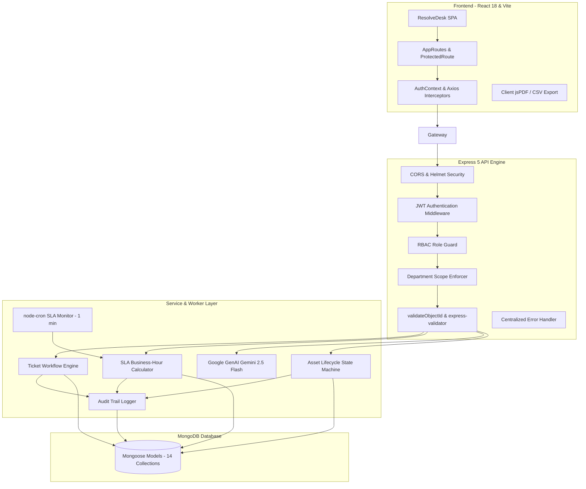

# ResolveDesk (ServiceDesk Pro)

> Modern, AI-enabled IT Service Management (ITSM) and Asset Lifecycle Platform for enterprise organizations.

ResolveDesk is an IT service management platform engineered to streamline employee support requests, hardware/software assets, incident resolution, SLAs, technician dispatching, and internal knowledge sharing. It features strict role-based access control (RBAC), department-isolated scopes, business-hour SLA escalation timers, and Google Gemini AI assistance for automatic ticket triage and solution recommendation.

---

## Table of Contents

- [Overview](#overview)
- [Problem Statement & Solution](#problem-statement--solution)
- [System Architecture](#system-architecture)
- [Key Features](#key-features)
- [Roles & Responsibilities](#roles--responsibilities)
- [Core Workflows](#core-workflows)
  - [Ticket Lifecycle & Manager Approval](#ticket-lifecycle--manager-approval)
  - [SLA Engine & Business Hours](#sla-engine--business-hours)
  - [Asset Lifecycle & Assignment](#asset-lifecycle--assignment)
  - [AI Classification & Solution Discovery](#ai-classification--solution-discovery)
- [Security & Authorization Model](#security--authorization-model)
- [Technology Stack](#technology-stack)
- [Project Structure](#project-structure)
- [Local Setup & Getting Started](#local-setup--getting-started)
- [Environment Configuration](#environment-configuration)
- [Screenshots & Demo](#screenshots--demo)
- [Deployment](#deployment)
- [Future Enhancements](#future-enhancements)
- [Documentation Links](#documentation-links)

---

## Overview

Modern organizations require reliable, auditable systems to manage internal IT operations. ResolveDesk provides a unified operational dashboard connecting employees who need assistance with IT specialists, departmental managers, and inventory stewards. Every transaction—from initial incident submission and automated triage to manager approval and equipment assignment—is tracked through an immutable audit trail.

---

## Problem Statement & Solution

### The Challenge
- **Disconnected IT Operations:** Support requests, asset assignments, and vendor warranties frequently live across fragmented spreadsheets and isolated chat channels.
- **Uncontrolled Scoping & Data Leaks:** IT managers often have visibility into other departments' confidential tickets, and employees risk viewing sensitive internal triage notes.
- **SLA Inaccuracies:** Traditional timers calculate raw clock time instead of factoring in working business hours, weekends, and organizational holidays, leading to misleading SLA breach warnings.
- **Triage Bottlenecks:** Technicians spend excessive time categorizing tickets, assessing priority, and searching for repeat solutions.

### The ResolveDesk Solution
- **Unified Portal:** Combines incident ticketing, asset tracking, vendor management, and knowledge sharing into a single responsive web interface.
- **Authoritative Server-Side Isolation:** Enforces strict department scoping at the database query level. IT managers cannot view out-of-department incidents, and technicians can only access assigned tickets.
- **Business-Hour SLA Engine:** Automatically calculates exact resolution and response deadlines respecting organizational schedules, working days, and configured holidays.
- **AI-Assisted Diagnostics:** Uses Google Gemini to automatically classify categories, determine priorities, diagnose probable root causes, and surface relevant knowledge articles to technicians.

---

## System Architecture



For detailed component-level breakdowns:
- **Server Architecture:** See [backend/README.md](backend/README.md).
- **Client Architecture:** See [frontend/README.md](frontend/README.md).

---

## Key Features

- **Authentication & RBAC:** Secure JWT authentication with role authorization and legacy alias compatibility.
- **Department-Based Scoping:** Server-level query isolation guaranteeing departmental privacy.
- **Complete Ticket Lifecycle:** Ticket creation, assignment, progression, manager resolution approval, and reopening.
- **Configurable SLA Policies:** Business-hour calculation engine with automated at-risk warnings, breach tracking, and auto-escalation.
- **Hardware & Software Asset Management:** Lifecycle state machine tracking procurement, availability, user assignment, maintenance, and retirement.
- **Vendor Management:** Comprehensive supplier records linked to asset procurement and warranties.
- **AI Diagnostics & Suggestions:** Integrated Gemini 2.5 Flash with heuristic fallback for ticket categorization, priority scoring, root cause analysis, and knowledge article discovery.
- **Centralized Knowledge Base:** Searchable internal articles with role-based visibility controls (drafts for staff, published solutions for all).
- **Audit Trails:** Immutable activity logs capturing actor identity, target entity, timestamp, and actions.
- **Real-Time Alerts:** In-app operational notifications and broadcast banner alerts for high-priority incidents.
- **Dashboards & Exportable Reports:** Role-tailored workload and compliance dashboards with streaming CSV and client-side PDF export generation.

---

## Roles & Responsibilities

The system defines five canonical roles with strict operational responsibilities:

| Role | Responsibilities | Access Scope |
|---|---|---|
| **System Admin** | Manages organizations, departments, categories, SLA policies, user accounts, system configs, and inspects global audit logs. | Unrestricted global access across the entire platform. |
| **IT Manager** | Oversees departmental ticket queues, assigns technicians, monitors SLA compliance, approves or rejects ticket resolutions, and tracks team workload. | Strictly scoped to tickets and technicians in their assigned department. |
| **Technician** | Investigates assigned incidents, posts work logs and internal notes, requests resolution approval, and flags assets for maintenance. | Scoped strictly to tickets assigned to them or tickets in `authorizedTechnicians`. |
| **Employee** | Submits support requests, tracks ticket status, uploads evidence attachments, communicates via public comments, and confirms resolutions. | Scoped strictly to self-created tickets. Zero access to internal notes or work logs. |
| **Asset Manager** | Oversees inventory procurement, manages physical/software asset assignments to employees, and tracks vendor contracts/warranties. | Full authority over assets and vendors. Zero access to support tickets. |

---

## Core Workflows

### Ticket Lifecycle & Manager Approval

Incident tickets transition through an audited state machine preventing illegal jumps:

```
[open] ──► [assigned] ──► [in_progress] ──► [resolved]
                              ▲                 │
                              │                 ▼ (Technician resolve)
                              │    [awaiting_manager_approval]
                              │         │              │
                              │         ▼ (Reject)     ▼ (Approve)
                              └─────────┴──────────► [closed] ──► [reopened]
```

1. **Creation:** An Employee submits a ticket. Category and priority are set or AI-inferred; department is automatically mapped.
2. **Assignment:** An IT Manager assigns the ticket to a Department Technician (`PATCH /api/tickets/:id/assign`).
3. **Resolution:** When work is complete, the Technician marks the ticket as resolved. The status automatically shifts to `awaiting_manager_approval`. Technicians cannot bypass this or directly close tickets.
4. **Manager Decision:**
   - **Approve:** The IT Manager approves the resolution. The ticket transitions to `closed`, stamping `approvedBy` and `approvedAt`.
   - **Reject:** The IT Manager rejects the resolution with feedback notes. The ticket reverts to `in_progress` with `resolvedAt` reset to `null`.
5. **Reopening:** If an issue recurs, an Employee or IT Manager can transition `closed` tickets back to `reopened`.

---

### SLA Engine & Business Hours

The SLA subsystem enforces compliance based on true operational hours:

- **Business-Hour Logic:** Skips non-working days (Mon–Fri), non-operational hours (09:00–17:00 UTC), and statutory organization holidays.
- **Dual Timers:**
  - **First-Response SLA:** Clock stops on the first staff comment or work log.
  - **Resolution SLA:** Target completion deadline based on priority.
- **SLA Progression:** `not_started` ──► `active` ──► `at_risk` (≥80% time consumed) ──► `breached` (past target date) ──► `met` (resolved within window).
- **Automated Monitoring:** A background `node-cron` job scans open tickets every minute, updates statuses, and sends notifications for at-risk and breached incidents.

---

### Asset Lifecycle & Assignment

Hardware and software inventories follow strict lifecycle state transitions:

```
[procurement] ──► [available] ◄────► [assigned]
                       │                 │
                       ▼                 ▼
                 [maintenance] ◄─────────┘
                       │
                       ▼
                   [retired]
```

- **Assignment:** Asset Managers and Admins assign assets in `available` state to any active organization user (`PATCH /api/assets/:id/assign`).
- **Return:** Returning an asset clears user associations and moves it back to `available`.
- **Maintenance:** Technicians and managers can flag malfunctioning assets for maintenance.
- **Retirement Guard:** Retired equipment cannot re-enter active rotation without explicit administrative reactivation (`reactivate=true`).

---

### AI Classification & Solution Discovery

Powered by the Google GenAI SDK (`@google/genai`) using Gemini 2.5 Flash:

- **Automated Triage (`POST /api/ai/tickets/:id/analyze`):** Ingests ticket details to suggest category, priority, probable issue identification, root cause diagnostic, and step-by-step troubleshooting actions.
- **Heuristic Fallback:** If `GEMINI_API_KEY` is not present, the system defaults to a built-in rule-based classification algorithm without throwing runtime errors.
- **Knowledge Recommendation (`POST /api/ai/tickets/:id/knowledge-suggestions`):** Performs semantic matching against published knowledge articles and surfaces top solutions to technicians resolving the ticket.

---

## Security & Authorization Model

> **Authoritative Security Principle:** Frontend visibility rules in React are purely for user experience. **The backend API is the sole source of truth and security boundary.**

- **Strict Server Scoping:** When an IT Manager requests data, the backend forces `query.department = req.user.department`. Query parameter tampering (e.g. `?department=OTHER`) is discarded.
- **Technician Containment:** Technicians can only access tickets where their user ID matches `assignedTo`, `authorizedTechnicians`, or `createdBy`.
- **Employee Privacy:** Employees cannot view internal staff notes (`isInternal: true`), technician work logs, or technical AI diagnostics.
- **Asset Manager Boundaries:** Asset Managers possess no permissions to view or mutate support tickets.

---

## Technology Stack

| Layer | Technology | Details |
|---|---|---|
| **Backend Runtime** | Node.js | v18+ with native ES6 modules (`"type": "module"`) |
| **Backend Framework** | Express 5 | RESTful architecture with structured middleware pipeline |
| **Database** | MongoDB | Document database interfaced via Mongoose 9 |
| **Authentication** | JWT & bcryptjs | 7-day signed Bearer tokens; password hashing salt factor 12 |
| **Scheduling** | node-cron | Minute-interval cron worker for SLA monitoring |
| **AI Integration** | Google GenAI SDK | `gemini-2.5-flash` model with heuristic fallback |
| **Frontend Framework** | React 18 | Single-page application built with Vite 5 |
| **Routing** | React Router v6 | Role-guarded routing via `<ProtectedRoute>` |
| **Styling & UI** | Vanilla CSS & Lucide | Modern design system with CSS custom properties and icons |
| **Animations** | Framer Motion | Fluid micro-interactions and animated navigation |
| **Client Reporting** | jsPDF & autoTable | Client-side generated PDF reports and streaming CSV exports |

---

## Project Structure

```
servicedesk-pro/
├── package.json               # Root monorepo development scripts
├── render.yaml                # Render cloud deployment blueprint
├── .env.example               # Root environment configuration template
├── README.md                  # Root architectural documentation
├── backend/                   # Express REST API application
│   ├── package.json           # Backend dependencies and seed scripts
│   ├── README.md              # Detailed backend architectural documentation
│   └── src/
│       ├── app.js             # Express app setup and middleware routing
│       ├── server.js          # HTTP server, DB connection, cron startup
│       ├── controllers/       # 17 domain controller modules
│       ├── middleware/        # Auth, RBAC, upload, ObjectId, validation handlers
│       ├── models/            # 14 Mongoose collection schemas
│       ├── routes/            # 16 Express API route files
│       ├── scripts/           # seedAdmin.js and seedManagers.js utilities
│       ├── services/          # AI, SLA, audit, notification, dashboard services
│       ├── utils/             # Business logic, lifecycle state machines, schedulers
│       └── validators/        # express-validator rule sets
├── frontend/                  # React Vite client application
│   ├── package.json           # Frontend dependencies and build scripts
│   ├── vite.config.js         # Vite configuration and development server proxy
│   ├── README.md              # Detailed frontend architectural documentation
│   └── src/
│       ├── App.jsx            # Layout container with Navbar, Sidebar, and Ticker
│       ├── main.jsx           # React DOM mounting entry point
│       ├── index.css          # Design system styling tokens and component classes
│       ├── components/        # Reusable UI widgets, navigation bars, and modals
│       ├── context/           # AuthContext managing user sessions and roles
│       ├── pages/             # 17 full-page application views
│       ├── routes/            # AppRoutes and ProtectedRoute guard
│       ├── services/          # Axios HTTP clients and PDF generation handlers
│       └── utils/             # Role definitions and UI helper functions
└── uploads/                   # Local file storage for ticket attachments
```

---

## Local Setup & Getting Started

### Prerequisites
- **Node.js:** v18.0.0 or higher
- **MongoDB:** Local installation running at `mongodb://127.0.0.1:27017` or a MongoDB Atlas URI
- **Git**

### Step-by-Step Installation

#### 1. Clone Repository & Install Dependencies
```bash
git clone https://github.com/AbhishikthPaul12/servicedesk_pro.git
cd servicedesk_pro

# Install backend dependencies
cd backend
npm install

# Install frontend dependencies
cd ../frontend
npm install
cd ..
```

#### 2. Configure Environment Variables
Copy and configure the environment file:
```bash
cp .env.example backend/.env
```
Ensure `MONGO_URI` and `JWT_SECRET` are populated in `backend/.env`.

#### 3. Seed Database Accounts
Seed administrative and department-scoped test users:
```bash
cd backend

# Seed default System Administrator
npm run seed:admin

# Seed IT Manager, Technician, Employee, and Asset Manager accounts
npm run seed:managers
cd ..
```

**Default Provisioned Test Accounts:**
| Role | Email | Password | Department |
|---|---|---|---|
| **System Admin** | `admin@servicedesk.com` | `Admin123!` | Global |
| **IT Manager** | `itmanager@servicedesk.com` | `Manager123!` | IT |
| **Technician** | `tech@servicedesk.com` | `Tech123!` | IT |
| **Employee** | `employee@servicedesk.com` | `Emp123!` | IT |
| **Asset Manager** | `assetmanager@servicedesk.com` | `Asset123!` | None (Assets only) |

#### 4. Start the Application

You can launch both services independently or from the root:

**Option A: Root Monorepo Commands**
```bash
# Terminal 1 - Backend server (:5000)
npm run dev:backend

# Terminal 2 - Frontend Vite server
npm run dev:frontend
```

**Option B: Separate Directories**
```bash
# Terminal 1 (Backend)
cd backend && npm run dev

# Terminal 2 (Frontend)
cd frontend && npm run dev
```

Navigate to `http://localhost:5173` in your browser.

---

## Environment Configuration

### Backend Configuration (`backend/.env`)

```ini
PORT=5000
NODE_ENV=development
MONGO_URI=mongodb://127.0.0.1:27017/resolvedesk
JWT_SECRET=super_secret_jwt_signing_key_replace_in_production
JWT_EXPIRES_IN=7d
CLIENT_URL=http://localhost:5173
GEMINI_API_KEY=your_optional_gemini_api_key_here
GEMINI_MODEL=gemini-2.5-flash
```

### Frontend Configuration (`frontend/.env`)

```ini
VITE_API_URL=http://localhost:5000
```
*(Leave blank during local development if leveraging Vite's internal development proxy).*

---

## Screenshots & Demo

*(Screenshots will be added in a future update. Key screens include:)*

1. **IT Operations Dashboard:** Executive summary displaying open incidents, SLA breach counters, and department technician workload.
2. **Interactive Ticket Details:** Real-time conversation thread, internal staff notes, work log entry drawer, and manager approval banner.
3. **Asset Inventory Catalog:** Hardware lifecycle overview with assignment modals and warranty tracking.
4. **SLA Management Console:** Priority configuration panel with response/resolution timers and business hour controls.
5. **AI Diagnostic Drawer:** On-demand Gemini triage output displaying root cause analysis and recommended solutions.

---

## Deployment

The application is pre-configured for cloud hosting platforms:

### 1. Backend on Render
A ready-to-use `render.yaml` specification is provided at the repository root:
- **Build Command:** `npm install`
- **Start Command:** `npm start`
- Set `NODE_ENV=production`, `MONGO_URI`, `JWT_SECRET`, and `CLIENT_URL`.

### 2. Frontend on Static Hosting (Vercel / Netlify / Render Static Site)
- **Root Directory:** `frontend`
- **Build Command:** `npm run build`
- **Publish Directory:** `dist`
- **Environment Variable:** Set `VITE_API_URL` to your live backend domain.
- Configure SPA rewrite rules directing `/*` to `/index.html`.

---

## Future Enhancements

- **Email / Inbound Webhook Parser:** Automatically convert incoming support emails into structured tickets.
- **WebSocket Gateway:** Real-time bi-directional ticket updates replacing client-side interval polling.
- **Hardware Barcode / QR Scanning:** Mobile camera integration in the frontend for barcode scanning during asset check-in/check-out.
- **Custom Form Builders:** Dynamic, category-specific form fields for specialized service requests.

---

## Documentation Links

For comprehensive subsystem and architectural documentation:
- 📖 [Backend Server & API Documentation](backend/README.md)
- 💻 [Frontend Client & React Documentation](frontend/README.md)
